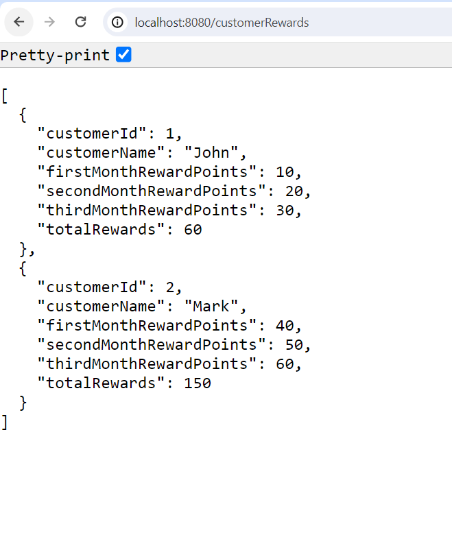

# customer-rewards

(1) Project created Using Springboot3.3.1 along with Java17
(2) Implemented a Rest api "/customerRewards" to calculate the reward points.
(3) Created a controller and a service layer to call the data from DB.
(4) Implemented a menthod "calcRewardPoints" in service layer to calculate the reward points.
(5) For testing purpose created an utility class for the dummy data to show upon the UI.

